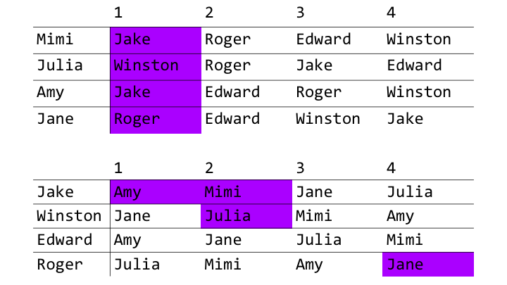
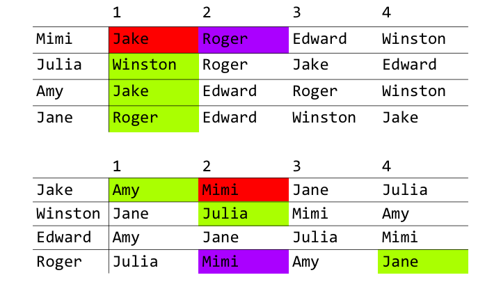
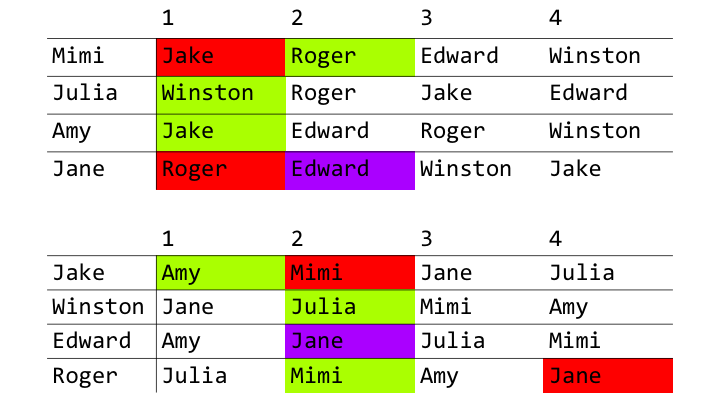
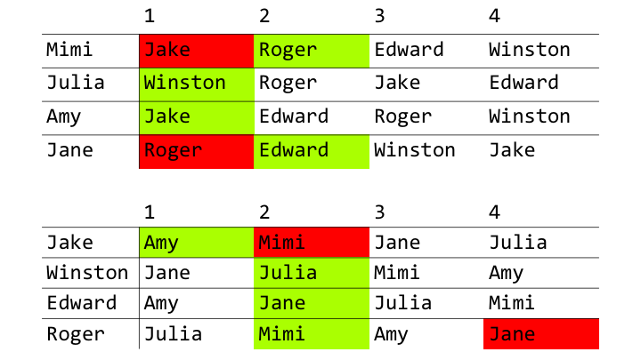

As it turns out, thanks to two men, David Gale and Lloyd Shapley, we can use maths to cure a global pandemic that has been plaguing humanity for far too long. That's right - we can cure *infidelity*. "Wait, no, that's impossible," you say. "Can we really reduce human desire and instinct to parameters of a finite and definite algorithm?" Probably not, but we can try.

<!--more-->

After watching [Numberphile’s video](https://www.youtube.com/watch?v=Qcv1IqHWAzg) on the Stable Marriage problem, I was inspired to research similar matching problems, so this will hopefully be one in a series of posts. But first, I’ll explain the Stable Marriage problem and discuss the algorithm that solves it.

## The Stable Marriage problem

The Stable Marriage problem consists of two equally sized sets – for simplicity, we will say one set is a group of men, whilst the other is a group of women (yes, we’ll have to look past heteronormativity for this post). The aforementioned parameters of 'human desire and instinct' are reduced to a list of preferences. Each man has a list of preferences ranking each woman and vice versa. In order to solve the Stable Marriage problem, a stable matching must be found, where everyone is married and no two people prefer each other over their spouse, reducing the likelihood of any cheating to occur to zero.

In 1962, mathematicians David Gale and Lloyd Shapley proved this problem can always be solved and provided the following algorithm.

## Gale-Shapley algorithm

In order to compensate for the heteronormativity, let's assume that the women are proposing to the men. The algorithm consists of iterations where any women who are still single propose to the highest ranking man on their list to whom they have not already proposed. The men then accept the woman they prefer the most out of the proposals they received and reject the other proposals, including their current fiancée, if they have one.

This can best be explained with an example. Let’s first define our to-be-weds and their preferences:

```python
# Dictionaries for set of women and men where key represents a person, 
# and value holds their list of preferences from least preferred to most.
		
women = {'Mimi':    ['Winston', 'Edward',  'Roger',   'Jake'],
         'Julia':   ['Edward',  'Jake',    'Roger',   'Winston'],
         'Amy':     ['Winston', 'Roger',   'Edward',  'Jake'],
         'Jane':    ['Jake',    'Winston', 'Edward',  'Roger']}

men =   {'Jake':    ['Julia',   'Jane',    'Mimi',    'Amy'],
         'Winston': ['Amy',     'Mimi',    'Julia',   'Jane'],
         'Edward':  ['Mimi',    'Julia',   'Jane',    'Amy'],
         'Roger':   ['Jane',    'Amy',     'Mimi',    'Julia']}
```
###### As an example, Mimi prefers Jake the most and Winston the least.

The following diagrams have the order of preference swapped around (that is, they go from most preferred to least). A little annoying, I know, but it's just nicer for the diagrams to go from most preferred to least, and, for the sake of reducing runtime, the dictionaries for our implementation to go from least preferred to most. Anyway, with these sets of men and women, the algorithm would play out as follows:

<span style="display:block;text-align:center"></span>

All of the women <span style="color:#aa00ff;">**propose**</span> to their top preference. Jake receives two proposals, Winston and Roger both receive one and Edward receives zero proposals. Poor Edward.

<span style="display:block;text-align:center"></span>

Winston and Roger <span style="color:#83d509;">**accept**</span> their only proposals. Jake has two, so he <span style="color:#83d509;">**accepts**</span> Amy and <span style="color:#fe0000;">**rejects**</span> Mimi because Amy is ranked higher on his list. Mimi is now left single, so she <span style="color:#aa00ff;">**proposes**</span> to Roger, the next highest person on her list.

<span style="display:block;text-align:center"></span>

Mimi is ranked higher on Roger’s list than Jane, his current fiancée. So he <span style="color:#fe0000;">**rejects**</span> Jane and <span style="color:#83d509;">**accepts**</span> Mimi. Now Jane is left single, so she <span style="color:#aa00ff;">**proposes**</span> to Edward.

<span style="display:block;text-align:center"></span>

Edward has had no proposals thus far, so he <span style="color:#83d509;">**accepts**</span> Jane. All of the couples have been matched and the algorithm stops. Congratulations Mimi and Roger, Julia and Winston, Amy and Jake, and Jane and Edward! Thanks to Gale and Shapley, you have all avoided disastrous marriages. You are all very welcome.

<span class="invertable" style="display:block;text-align:center"></span>

<span style="display:block;text-align:center">[[Source: xkcd]](https://xkcd.com/310/)</span>

### Implementation in Python

Here is how the algorithm can be implemented in Python:

```python
def stable_match(proposers, proposees):
    """
    Use the Gale-Shapley algorithm to find a stable matching between two sets.

    :param proposers: dict where key represents a proposer, and value holds their list of preferences 
                      (least preferred to most)
    :param proposees: dict where key represents a proposee, and value holds their list of preferences 
                      (least preferred to most)
    :return: dict where key, value pairs correspond to a matched couple
    """
    proposers = copy.deepcopy(proposers)
    proposees = copy.deepcopy(proposees)
    proposer_queue = list(proposers.keys())
    couples = {}

    # Whilst there is a proposer yet to be engaged...
    while len(proposer_queue):
        proposer = proposer_queue.pop(0)
        proposee = proposers[proposer].pop()
        print("%s proposed to %s." % (proposer, proposee))
        if proposee not in couples:
            # The proposee is single!
            couples[proposee] = proposer
            print("%s accepted %s's proposal." % (proposee, proposer))
        else:
            # The proposee is already engaged
            fiance = couples[proposee]
            if proposees[proposee].index(proposer) > proposees[proposee].index(fiance):
                # The proposee prefers the proposer to their fiance
                couples[proposee] = proposer
                proposer_queue.append(fiance)  # Fiance is now single :(
                print("%s accepted %s's proposal and left %s." % (proposee, proposer, fiance))
            else:
                # The proposer is still single :(
                proposer_queue.append(proposer)
                print("%s rejected %s because they are already engaged to %s." % 
                      (proposee, proposer, fiance))

    # We found our stable matches!
    return couples
```

We can call our `stable_match` function and pass in our dictionaries that we declared earlier:

```
>>> print(stable_match(women, men))
Mimi proposed to Jake.
Jake accepted Mimi's proposal.
Julia proposed to Winston.
Winston accepted Julia's proposal.
Amy proposed to Jake.
Jake accepted Amy's proposal and left Mimi.
Jane proposed to Roger.
Roger accepted Jane's proposal.
Mimi proposed to Roger.
Roger accepted Mimi's proposal and left Jane.
Jane proposed to Edward.
Edward accepted Jane's proposal.
{'Jake': 'Amy', 'Winston': 'Julia', 'Roger': 'Mimi', 'Edward': 'Jane'}
```

### Time complexity

Since infidelity is a worldwide phenomenon that does not discriminate, it would be useful to know how well this algorithm scales as the number of men and women being considered increases.

Let's consider what would happen in the worst case. We know that a woman can make at most $$n$$ proposals, where $$n$$ is the number of men (which is also the number of women). However, once every man receives at least one proposal, the algorithm terminates. We know this because the algorithm guarantees that once everyone is engaged, the matching is stable. Therefore, $$n-1$$ men will receive $$n$$ proposals, whilst one man will receive 1 proposal. In total, that's $$n(n-1) + 1$$ proposals.

If we were to write this in Big O notation, which is to remove any lower order terms and constants, we would get that the time complexity of the algorithm is $$O(n^2)$$. This means that as the number of men and women grows to an abritrarily large size, the time taken to find a stable matching grows quadratically.

### Bias in the algorithm

Unfortunately (but pretty interestingly), this algorithm is biased towards one of the two sets - the proposers, who are, in this case, the women. We can see that a woman cannot do any better than the man to whom they are engaged because any man that is ranked above who she ended up with rejected her proposal whilst the algorithm was running. In turn, this also proves that a man cannot do any worse than the woman to whom they are engaged. 

### Real-life applications

Real-life applications? You mean... like, solving infidelity and providing the human race with Stable Marriages? Sure, if everyone was straight, monogamous, could identify as one of two categories, and we could get everyone to submit a list of preferences ranking the other half of the population. 

So, the Gale-Shapley algorithm to solve the Stable Marriage problem may not be so useful for actually providing stable marriages in the real world. However, the algorithm often plays a role in solving many other important problems, such as assigning graduating med students to hospitals for residency, and assigning users to servers in CDNs.

## Conclusion

Real-world impracticalities aside, let me know if you would let an algorithm determine who you get stuck with for the rest of your life. And if you would, why?