Join me in this follow-up to the [post on the Stable Marriage problem](https://faishasj.github.io/2018/09/09/how-maths-can-guarantee-marital-bliss.html) as we ignore the polyamorous yet again for the sake of framing an algorithm in an interesting but infeasible context. 

<!--more-->

I was talking to my heterosexual partner one day about what it would be like if everyone had the potential to be attracted to each other. Would it be easier if everyone was bisexual<sup>1</sup> or pansexual<sup>2</sup>? Let's forget the minor fact that attraction is complex and that other factors outside of gender exist for a quick minute. The conversation went something like this:

>**me**: How much easier would it be if everyone was bi or pan? Everyone would have the *potential* to be attracted to everyone else and vice versa.
>
>**them**: How is that any different from everyone being heterosexual or homosexual? If everyone was monosexual<sup>3</sup>, you would still only be attracted to someone who is capable of being attracted to you.
>
>**me**: You're missing the point. It's not only that it eliminates the possibility of being attracted to someone who isn't attracted to you. You're essentially doubling the size of the pool.
>
>**them**: Right, so everyone has a better chance at finding *The One*.
>
>**me**: Yea. Although, now that I think about it, it wouldn't be guaranteed that everyone finds *The One*. It turns into a Stable *Roommates* problem, instead of a Stable *Marriage* one.
>
>**them**: Okay, now you've lost me.

It was at that moment that I realised I should probably stop trying to explain everything in computer science concepts.

**<sup>1</sup> bisexual**: Attraction to two or more genders.<br>
**<sup>2</sup> pansexual**: Attraction *regardless* of gender.<br>
**<sup>3</sup> monosexual**: Attraction to one gender. Homosexuality and heterosexuality are monosexual orientations. The opposite of this is **polysexual**.

## The Stable Roommates problem

The Stable Roommates problem is similar to the Stable Marriage problem in that it asks whether a stable matching can be found for a group of people with a list of preferences. However, unlike the Stable Marriage problem where there are two sets, the Stable Roommates problem involves only **one set** with everyone ranking everyone else in order of preference. 

In other words, the Stable Marriage problem models a monosexual society, whereas the Stable Roommates problem models a polysexual society.

Additionally, a stable matching is not always guaranteed. This is in contrast to the Stable Marriage problem where a stable matching can always be found. 

Robert Irving presented an algorithm that determines whether a stable matching can be found for a set of people and their preferences, and provides the matching if it is possible.

## Irving's algorithm

Let’s start with our set of potential roomies and their preferences:

```python
roommates = {'Randall': ['Scout',   'Ramona',  'Atticus', 'Molly',   'Jay'],
             'Scout':   ['Atticus', 'Jay',     'Randall', 'Ramona',  'Molly'],
             'Ramona':  ['Atticus', 'Molly',   'Scout',   'Randall', 'Jay'],
             'Jay':     ['Randall', 'Ramona',  'Molly',   'Scout',   'Atticus'],
             'Atticus': ['Randall', 'Scout',   'Jay',     'Molly',   'Ramona'],
             'Molly':   ['Scout',   'Randall', 'Jay',     'Ramona',  'Atticus']}
```

###### As an example, Randall prefers Scout the most and Jay the least.

The algorithm can be split up into three different phases so we will be going through the steps of each phase using the example set above.

### Phase 1: Proposing, holding and rejecting

In this phase, the roommates propose to their top preference, similar to SMP. However, when a roommate receives more than one proposal, they hold the proposal from the person they most prefer and symmetrically reject all other proposals – this means that whilst the proposee removes the proposer from their list of potential roommates, the proposer must also remove the proposee from their list. If a proposer is rejected, they must propose to the next highest person on their list. This phase lasts until everyone has successfully proposed:

<span style="display:block;text-align:center">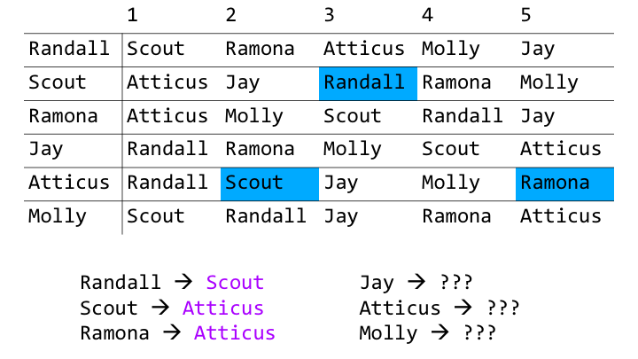</span>

Randall proposes to Scout. Scout has not received any prior proposals, so she holds his proposal. Scout and Ramona both propose to Atticus, so now he holds two proposals.

<span style="display:block;text-align:center">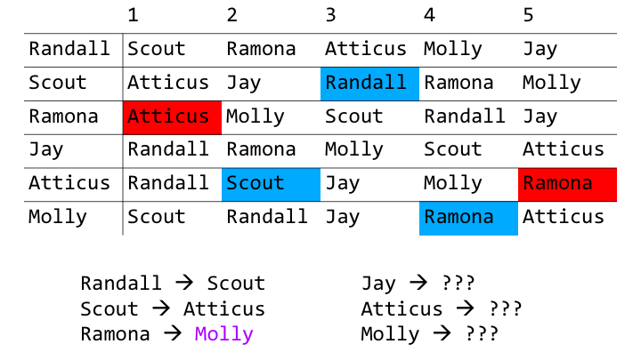</span>

Atticus rejects Ramona’s proposal because Scout is ranked higher on his list. Symmetrically, Ramona rejects Atticus. She now proposes to Molly who holds her proposal.

<span style="display:block;text-align:center">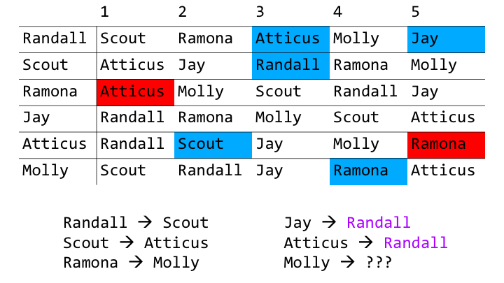</span>

Next, Jay and Atticus both propose to Randall, who is now holding two proposals.

<span style="display:block;text-align:center">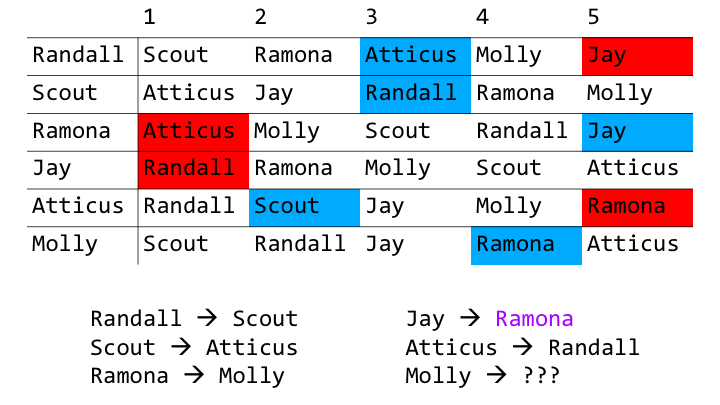</span>

Randall chooses to hold Atticus’ proposal, therefore Randall and Jay symmetrically reject each other. Jay moves on to propose to Ramona, who holds his proposal.

<span style="display:block;text-align:center">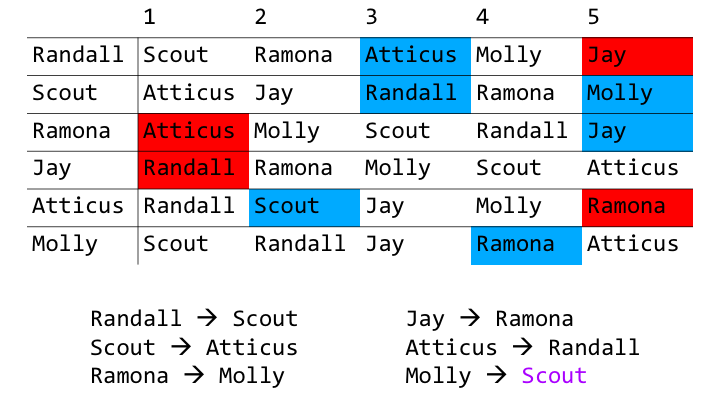</span>

Molly is the only one who has not successfully proposed, so she proposes to Scout.

<span style="display:block;text-align:center">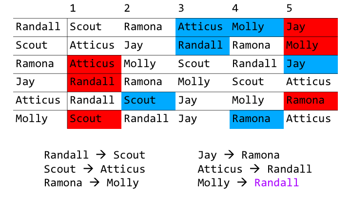</span>

Scout is already holding a proposal from Randall, who is ranked higher on his list than Molly. Molly and Scout symmetrically reject each other. She then proposes to Randall.

<span style="display:block;text-align:center">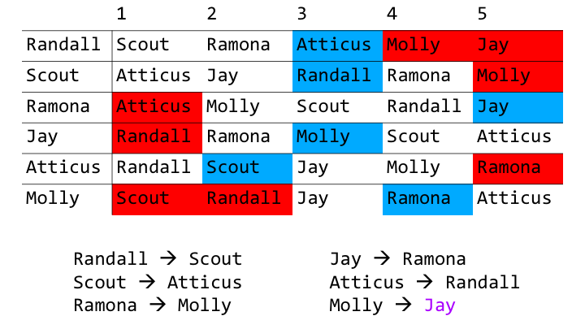</span>

Unfortunately, Randall is also already holding a proposal from Atticus, who is higher up on his list than Molly. Randall and Molly symmetrically reject each other. She now proposes to Jay, who has not received any prior proposals. He now holds her proposal, and phase 1 of the algorithm ends.

### Phase 2: Ruling out worse matches

Hopefully, you got through the first phase and understood everything! This phase consists of more symmetrical rejections. Each person now symmetrically rejects anyone who is ranked lower than the person they are currently holding a proposal from. To continue demonstrating, let’s first simplify the table so that we are only colour-coding rejections:

<span style="display:block;text-align:center">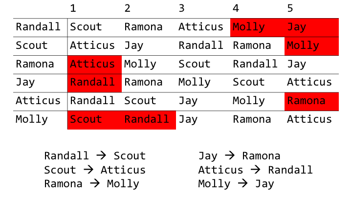</span>

Since this phase is fairly straightforward, let’s jump ahead to the end.

<span style="display:block;text-align:center"></span>

As an example, Randall is holding a proposal from Atticus, but Molly and Jay have already been rejected so we don’t need to do anything there. Scout is holding a proposal from Randall, so Scout rejects Ramona and Ramona rejects Scout. This continues until there are no more symmetrical rejections to be made. Everyone now has a reduced list of preferences.

At this point, we can determine whether the table is stable. A table is considered stable if for any two people p and q:

- If p is first in q‘s reduced list, q is the last on p‘s.
- p has symmetrically rejected everyone less preferable to whom p is currently holding a proposal from.
- No reduced list is empty.

If the table is unstable, no stable matchings can be found for this set of roommates. However, if a table is stable at this stage (like our example), it does not guarantee that we will end up with stable matchings. Rather, a stable table has important properties that justify the next steps of the algorithm:

- A stable table is a subtable of the Phase 1 table, which is to say that it has the same set of preference lists only with some individuals removed.
- If every reduced list in a stable table contained exactly one individual, then pairing each individual with the single person on their list would provide a stable matching.
- If the Stable Roommates problem instance has a stable matching, then there is a stable matching contained in any one of the stable tables.
- Any stable subtable of a stable table can be obtained by a sequence of rotation eliminations on the stable table. These ‘rotation eliminations’ form the next phase of the algorithm.

### Phase 3: Rotation eliminations

Now that we have determined our Phase 2 table is stable, we can move on to the next phase. The steps in this phase are a little harder to grasp, so I’ll try my best to explain. Let’s create another table with rows labelled p and q.

<span style="display:block;text-align:center">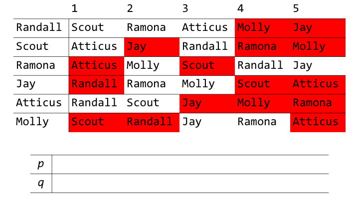</span>

We start the rotation by choosing any individual to place in p<sub>0</sub> and proceeding as follows:

q<sub>i</sub> is the second preference of p<sub>i</sub>.
p<sub>i+1</sub> is the last preference of q<sub>i</sub>.
We continue until the same name appears in the same row twice. Let’s choose Randall and fill up the table.

<span style="display:block;text-align:center">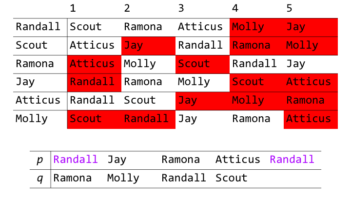</span>

Starting with Randall, his second preference out of his reduced list is Ramona, so Ramona is placed below Randall in row q. Ramona’s last preference is Jay, so he is placed above and to the right of Ramona in row p. Jay’s second preference is Molly, so she is placed below Jay in row q. Hopefully, you understand how we derive the rest of the table. We stop at Randall in p4 because he has already appeared in that row once.

Once the rotation terminates, for every q<sub>i</sub>, they must symmetrically reject their last preference i.e p<sub>i+1</sub>.

<span style="display:block;text-align:center">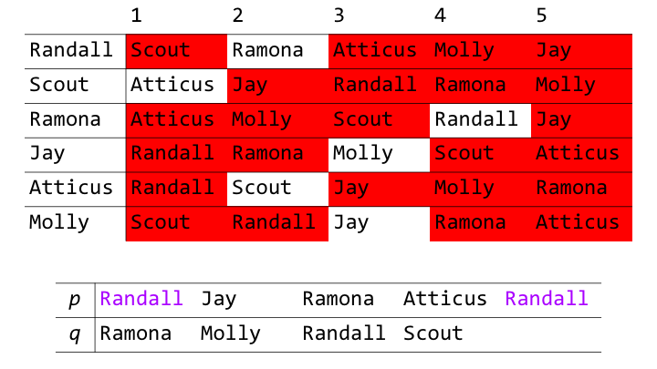</span>

This means that Ramona and Jay reject each other, Molly and Ramona reject each other, Randall and Atticus reject each other, and Scout and Randall reject each other.

If at this point, an individual still exists with more than one person in their preference list, the rotation round and subsequent symmetrical rejections must be repeated. However, in our example, everyone has reduced their list to exactly one individual. We’ve found a stable matching!

<span style="display:block;text-align:center">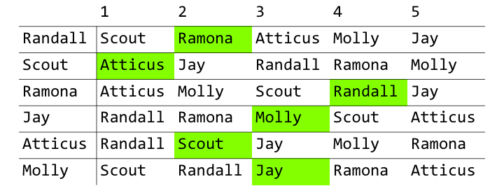</span>

Our final roommate pairings: Randall and Ramona, Scout and Atticus, and Molly and Jay.

## Back to our sexually-perfect society scenario...

Now that we know that the Stable Roommates problem does not guarantee a stable matching, we could argue that a society in which all of its members are capable of being attracted to one another regardless of gender may not be ideal - if we're all looking to find *'The One'*. But as we mentioned before, this won't ever happen due to a multitude of reasons. In fact, this whole thought experiment was actually pretty ridiculous.

So why did I even use this as a context in which to introduce this algorithm? Well because it was fun. At least, for me it was. If it wasn't for you, hopefully you still learnt something? :/