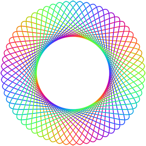
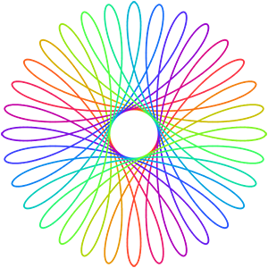
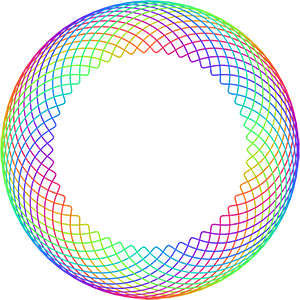
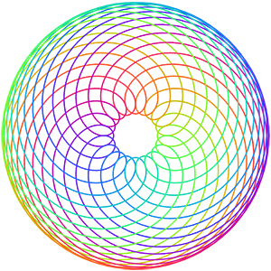
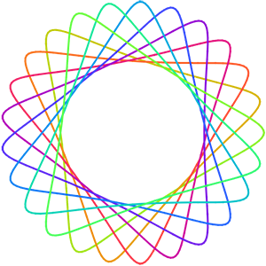

A year ago, I was introduced to the Spirograph toy when I was looking for a [gift I could 3-D print](https://www.thingiverse.com/thing:905849) for a friend. (Yes, I'm 20 years late.) Whilst I was realising what was missing from my childhood and wasting tons of paper, I could not stop thinking about the maths behind it. So here is a fun post about the maths behind the Spirograph toy, complete with some sexy curves (SFW) created using my [Spirograph web app](https://faishasj.github.io/spirograph/). 

<!--more-->

## Roulettes

Let's start with the equation of the curves formed by the Spirograph toy. In order to understand how the Spirograph works, we need to first learn some geometry of curves.

A roulette is the curve traced by a fixed point on a closed convex curve that rolls along another secondary curve without slipping. 

<span class="invertable" style="display:block;text-align:center"></span>

<span class="invertable" style="display:block;text-align:center"></span>

<span style="display:block;text-align:center">[[Source: Wolfram MathWorld]](http://mathworld.wolfram.com/Roulette.html)</span>

The Spirograph toy traces out two kinds of roulettes, namely hypotrochoids and epitrochoids. 

### Hypotrochoids

A hypotrochoid is a roulette in which the fixed point is attached to a circle that rolls *inside* a stationary circle. We can draw hypotrochoids with the Spirograph by rolling the wheel around the inside of the ring. 

|||
|--|--|

###### Values for LHS curve: $R = 320$, $r = 105$, $p = 70$. Values for RHS curve: $R = 320$, $r = 210$, $p = 160$. Screenshots taken with the save image feature from my [web app](https://faishasj.github.io/spirograph/).

Let $$R$$ be the radius of the stationary circle, $$r$$ be the radius of the rotating circle, $$p$$ be the distance of the fixed point from the center of the rotating circle and a parameter $$t$$ be the angle formed by the horizontal and the centre of the rotating circle. 

<span class="invertable" style="display:block;text-align:center">
</span>
<span style="display:block;text-align:center">[[Source: Sam Derbyshire]](https://en.wikipedia.org/wiki/Hypotrochoid#/media/File:HypotrochoidOutThreeFifths.gif)</span>

The centre of the rotating circle is always $$R - r$$ distance away from the centre of the fixed circle. This circle also obeys circular motion. If we assume our fixed circle is centred at the origin on the Cartesian plane, like in the animation above, we get the following parametric equations for the centre of the rotating circle:

$$
x_c(t) = (R - r)\cos(t)
$$

$$
y_c(t) = (R - r)\sin(t)
$$

We also need to derive the position of the fixed point relative to the centre of the rotating circle. 

(Note that in the animation above, the fixed point is outside the rotating circle. Whilst this fixed point is still 'attached' to the rotating circle, making it a hypotrochoid, this technically is not possible with the physical Spirograph toy.) 

Because the parameter $$t$$ is the angle formed by the horizontal and the centre of the rotating circle, our relative parameter $$t'$$, which represents the angle formed by the radius of the rotating circle parallel to the horizontal and the fixed point, can be expressed as:

$$
t' = -\frac{R - r}{r} t
$$

Why is it negative? Well, if we have the rotating circle move inside the fixed circle in a counterclockwise direction, like in the animation above, we can see that the circle actually *rotates* in a clockwise direction. This means that our fixed point will always move around the centre of the rotating circle in the opposite direction that the rotating circle moves around the centre of the fixed circle.

Our fixed point also obeys circular motion, therefore the parametric equations for the fixed point relative to the centre of the rotating circle are:

$$
x_{p_c}(t) = p\cos(-\frac{R - r}{r} t)
$$

$$
y_{p_c}(t) = p\sin(-\frac{R - r}{r} t)
$$

We can now add the $$x_c$$ to $$x_{p_c}$$ and $$y_c$$ to $$y_{p_c}$$ find the parametric equations for a hypotrochoid:

$$
x(t) = (R - r)\cos(t) + p\cos(\frac{R - r}{r} t)
$$

$$
y(t) = (R - r)\sin(t) - p\sin(\frac{R - r}{r} t)
$$

### Epitrochoids

An epitrochoid is a roulette in which the fixed point is attached to a circle that rolls along the *outside* of a stationary circle. We can draw epitrochoids with the toy by rolling the wheel around the outside of the ring. 

| |  | 
|--|--|

###### Values for LHS curve: $R = 250$, $r = 85$, $p = 70$. Values for RHS curve: $R = 100$, $r = 95$, $p = 140$.

Again let $$R$$ be the radius of the stationary circle, $$r$$ be the radius of the rotating circle, $$p$$ be the distance of the fixed point from the center of the rotating circle and a parameter $$t$$ be the angle formed by the horizontal and the centre of the rotating circle.

<span class="invertable" style="display:block;text-align:center">
</span>
<span style="display:block;text-align:center">[[Source: Sam Derbyshire]](https://en.wikipedia.org/wiki/Epitrochoid#/media/File:EpitrochoidIn3.gif)</span>

Our parametric equations for an epitrochoid are similar to the hypotrochoid. Instead, the centre of the rotating circle is always $$R + r$$ distance away from the centre of the fixed circle, and because our fixed point will be moving around the centre of the rotating circle in the same direction the rotating circle moves around the centre of the fixed circle, our relative parameter $$t'$$ is now:

$$
t' = \frac{R + r}{r} t
$$

Thus, the parametric equations for an epitrochoid are:

$$
x(t) = (R + r)\cos(t) - p\cos(\frac{R + r}{r} t)
$$

$$
y(t) = (R + r)\sin(t) - p\sin(\frac{R + r}{r} t)
$$

## Implementing the Spirograph

As we saw earlier, these parametric equations can be split into two terms. The first term (e.g. $$(R - r)\cos(t)$$ for the x-coordinate of a hypotrochoid) expresses the position of the rotating circle relative to the centre of the fixed circle. Thus, in the `updateSpiro()` function of the [web app](https://faishasj.github.io/spirograph/), we get:

```javascript
posr = {x: mainCanvas.width / 2 + (R-r) * Math.cos(t), y: mainCanvas.height / 2 + (R-r) * Math.sin(t)};
```

for a hypotrochoid, and 

```javascript
posr = {x: mainCanvas.width / 2 + (R+r) * Math.cos(t), y: mainCanvas.height / 2 + (R+r) * Math.sin(t)};
```
for an epitrochoid. This allows us to draw the rotating circle rolling around the stationary circle.

The second term (e.g. $$-p\sin(\frac{R - r}{r} t)$$ for the y-coordinate of an epitrochoid) expresses the position of the pen relative to the centre of the rotating circle. Therefore, adding the terms gives us the position of the pen relative to the centre of the fixed circle. In the `updateSpiro()` function below the previous lines, we get:

```javascript
posPen = {x: posr.x + p * Math.cos((R-r) / r * t), y: posr.y - p * Math.sin((R-r) / r * t)};
```

for a hypotrochoid, and

```javascript
posPen = {x: posr.x - p * Math.cos((R+r) / r * t), y: posr.y - p * Math.sin((R+r) / r * t)};
```
for an epitrochoid. Now that we have the absolute position of the fixed point, or pen, we can display the actual result of the spirograph. 

## Deriving the number of petals

Let's recall that our parameter $$t$$ is the angle formed by the horizontal and the centre of the rotating circle. When measured in radians, $$t$$ takes the values 0 to $$2\pi\frac{LCM(R, r)}{r}$$ where $$LCM$$ is a function that returns the lowest common multiple. This means that the rotating circle will complete $$\frac{LCM(R, r)}{r}$$ revolutions, thus the Spirograph curve will have $$\frac{LCM(R, r)}{r}$$ petals. Pretty neat, right?

(In my [Spirograph web app](https://faishasj.github.io/spirograph/), I use this fact to ensure that the parametric equations for generating the multi-colour gradient pen ends at $$2\pi$$, in order to make the Spirograph curve look seamless. The whole colour theory behind this deserves its own post, but for now here is a [link to a great post about this](https://krazydad.com/tutorials/makecolors.php).)

Fortunately, calculating the $$LCM(x, y)$$ for two numbers $$x$$ and $$y$$ is as simple as:

$$
LCM(x, y) = \frac{|x \cdot y|}{GCD(x, y)}
$$

where $$GCD$$ is a function that returns the greatest common divisor. In order to obtain the $$GCD$$, we can use the [Euclidean algorithm](https://en.wikipedia.org/wiki/Euclidean_algorithm):

```javascript
// Calculate the greatest common divisor of two numbers
function gcd(x, y) {
	while(y) {
		var tmp = y;
		y = x % y;
		x = tmp;
  	}
  	return x;
}
```

Now we can calculate the number of petals a Spirograph curve will have. Inserted below are a hypotrochoid and epitrochoid drawn using the same values: $$R = 250$$, $$r = 80$$ and $$p = 50$$:

| | |
|--|--|

If you count the number of petals for both the hypotrochoid and epitrochoid, both the hypotrochoid and epitrochoid have 25 petals. Let's check that:

$$
\frac{LCM(250, 80)}{80} = \frac{|250 \cdot 80|}{GCD(250, 80) \cdot 80} = \frac{250}{10} = 25
$$

## Hypocycloids and epicycloids

Hypocycloids and epicycloids are very similar to hypotrochoids and epitrochoids, however the fixed point is always on the circumference of the rotating circle. This means that we can reduce the equation for a hypotrochoid and epitrochoid to that for a hypocycloid and epicycloid.

This time, let's say the radius of the larger circle $$R$$ is equal to $$kr$$, remembering $$r$$ is the radius of the smaller circle. We can now write the parametric equations as:

$$
x(t) = r(k - 1)\cos(t) + r\cos((k - 1)t)
$$

$$
y(t) = r(k - 1)\sin(t) - r\sin((k - 1)t)
$$

for a hypocycloid, and

$$
x(t) = r(k + 1)\cos(t) - r\cos((k + 1)t)
$$

$$
y(t) = r(k + 1)\sin(t) - r\sin((k + 1)t)
$$

for an epicycloid. Why write it in this way instead? The number of cusps, or sharp corners on the curve, is directly correlated to the ratio of the radius of larger circle to the radius of the smaller circle, or $$\frac{R}{r}$$. Thus, the number of cusps is directly correlated to $$k$$.

If $$k$$ is an integer, the curve has $$k$$ cusps:

| k = 3 | k = 4 | k = 5 | k = 6 | k = 7 |
|-------|-------|-------|-------|-------|
||||||

###### Hypocycloids with integer $k$ values.

| k = 1 | k = 2 | k = 3 | k = 4 | k = 5 |
|-------|-------|-------|-------|-------|
||||||

###### Epicycloids with integer $k$ values.

If $$k$$ is a rational number, that is it can be expressed as $$\frac{p}{q}$$ where $$p$$ and $$q$$ are integers, the curve has $$p$$ cusps:

| k = $$\frac{5}{3}$$ | k = $$\frac{7}{3}$$ | k = $$\frac{8}{3}$$ | k = $$\frac{9}{5}$$ | k = $$\frac{10}{7}$$ |
|-------|-------|-------|-------|-------|
||||||

###### Hypocycloids with rational $k$ values.

| k = $$\frac{5}{3}$$ | k = $$\frac{7}{3}$$ | k = $$\frac{8}{3}$$ | k = $$\frac{9}{5}$$ | k = $$\frac{10}{7}$$ |
|-------|-------|-------|-------|-------|
||||||

###### Epicycloids with rational $k$ values.

If $$k$$ is an irrational number, the curve never closes.